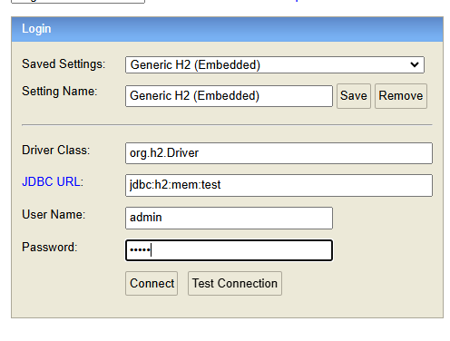
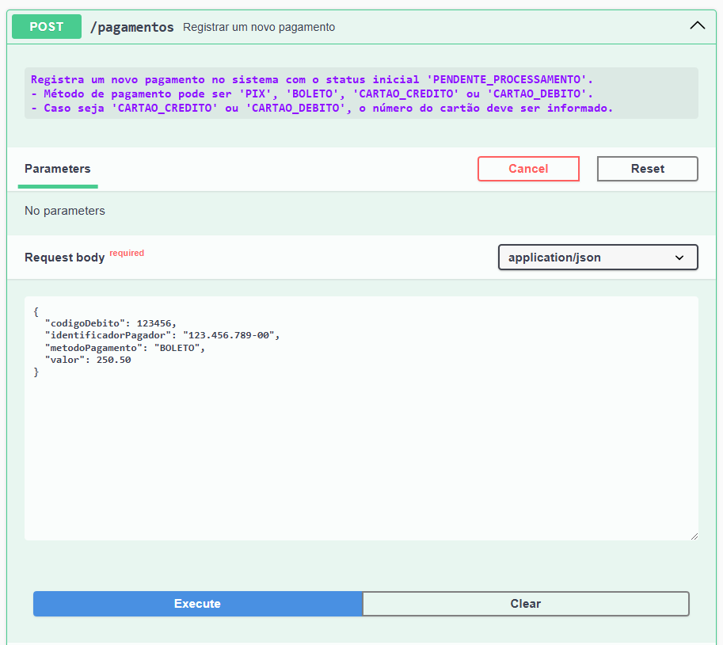

# Documentação do Projeto - API de Pagamentos

## Iniciado Projeto

Este projeto é uma API de gerenciamento de pagamentos utilizando arquitetura limpa e padrão State para validação e transição de estados.

## Tecnologias Utilizadas

- **Spring Boot** para desenvolvimento da API.
- **Banco de Dados H2** em memória para facilitar os testes.
- **Swagger** para documentação interativa.
- **Clean Architecture** para maior organização e separação de responsabilidades.
- **Padrão State** para manipulação e validação do ciclo de vida de pagamentos.

## Benefícios do Padrão State

O uso do padrão State permite:

1. **Organização clara** de regras de transição de estados.
2. **Validação centralizada**: cada estado sabe como manipular suas próprias transições.
3. **Flexibilidade para mudanças**: é fácil adicionar novos estados ou modificar a lógica de um estado existente.
4. **Maior manutenção**: o código fica modular e fácil de entender.

# Como acessar a API e o banco de dados

## Acessar a API pelo Swagger

Link do Swagger:
```
http://localhost:8080/swagger-ui/index.html
```

## Acessar banco de dados em memória H2

- URL do console:
```
http://localhost:8080/h2-console/
```
- Configurações:
  - **JDBC URL**: `jdbc:h2:mem:test`
  - **Username**: `admin`
  - **Password**: `admin`



# Exemplo de Cadastro de Pagamento

### Endpoint de Criação
- **POST** `/pagamentos`

#### Exemplo de Requisição
```json
{
  "codigoDebito": 123456,
  "identificadorPagador": "123.456.789-00",
  "metodoPagamento": "BOLETO",
  "valor": 250.50
}
```

#### Exemplo de Resposta
```json
{
  "id": 4,
  "codigoDebito": 123456,
  "identificadorPagador": "123.456.789-00",
  "metodoPagamento": "BOLETO",
  "numeroCartao": null,
  "valor": 250.5,
  "status": "PENDENTE_PROCESSAMENTO"
}
```



# Testes de Atualização de Pagamento

## 1. Quando o pagamento está **PENDENTE_PROCESSAMENTO**

### Cenário esperado:
- Pode ser alterado para **PROCESSADO_SUCESSO** ou **PROCESSADO_FALHA**.

### Exemplo de Requisição
- **PUT** `/pagamentos/{id}`

```json
{
  "codigoDebito": 123456,
  "identificadorPagador": "123.456.789-00",
  "metodoPagamento": "BOLETO",
  "valor": 250.50,
  "status": "PROCESSADO_SUCESSO"
}
```

### Resposta esperada:
- **Código HTTP**: `200 OK`
- O status é atualizado para **PROCESSADO_SUCESSO**.

## 2. Quando o pagamento está **PROCESSADO_SUCESSO**

### Cenário esperado:
- **Não pode** ter o status alterado.

### Exemplo de Requisição
- **PUT** `/pagamentos/{id}`

```json
{
  "codigoDebito": 123456,
  "identificadorPagador": "123.456.789-00",
  "metodoPagamento": "BOLETO",
  "valor": 250.50,
  "status": "PROCESSADO_FALHA"
}
```

### Resposta esperada:
- **Código HTTP**: `400 Bad Request` ou `409 Conflict`.
- **Mensagem**: "Pagamentos processados com sucesso não podem ser alterados."

## 3. Quando o pagamento está **PROCESSADO_FALHA**

### Cenário esperado:
- Pode ser alterado **apenas** para **PENDENTE_PROCESSAMENTO**.

### Exemplo de Requisição
- **PUT** `/pagamentos/{id}`

```json
{
  "codigoDebito": 123456,
  "identificadorPagador": "123.456.789-00",
  "metodoPagamento": "BOLETO",
  "valor": 250.50,
  "status": "PENDENTE_PROCESSAMENTO"
}
```

### Resposta esperada:
- **Código HTTP**: `200 OK`
- O status é atualizado para **PENDENTE_PROCESSAMENTO**.

# Validação dos Testes

1. Inicialize o pagamento com o status **PENDENTE_PROCESSAMENTO**.
2. Crie um novo pagamento com o status inicial **PENDENTE_PROCESSAMENTO**.
3. Altere para **PROCESSADO_SUCESSO** ou **PROCESSADO_FALHA** e valide.
4. Tente alterar o status para cenários inválidos e valide se a API retorna erro.
5. Realize alterações permitidas entre **PROCESSADO_FALHA** e **PENDENTE_PROCESSAMENTO**.

# Endpoints Disponíveis

### Pagamento Controller

| Método | Endpoint                                   | Descrição                                           |
|--------|-------------------------------------------|---------------------------------------------------|
| GET    | `/pagamentos/{id}`                        | Obter informações de um pagamento.               |
| PUT    | `/pagamentos/{id}`                        | Atualizar um pagamento.                          |
| DELETE | `/pagamentos/{id}`                        | Excluir pagamento logicamente.                  |
| GET    | `/pagamentos`                             | Listar todos os pagamentos.                     |
| POST   | `/pagamentos`                             | Registrar um novo pagamento.                    |
| GET    | `/pagamentos/filtro/status/{status}`      | Filtrar pagamentos por status.                  |
| GET    | `/pagamentos/filtro/cpfOuCnpj/{cpfOuCnpj}`| Filtrar pagamentos por CPF ou CNPJ.             |
| GET    | `/pagamentos/filtro/codigoDebito/{codigoDebito}` | Filtrar pagamentos por código de débito. |

# Conclusão

Este projeto demonstrou a utilização de boas práticas no desenvolvimento de APIs RESTful, com um foco especial em arquitetura limpa e padrões como o State, garantindo flexibilidade, organização e robustez.

# Testes Unitários - Sucesso

Este documento descreve os testes unitários criados para validar os cenários de sucesso dos métodos implementados no caso de uso `PagamentoUseCaseImpl`. Esses testes foram desenvolvidos para garantir o funcionamento correto de cada unidade individualmente.

## Testes Criados

### 1. **deveCriarPagamentoComSucesso**
- **Objetivo**: Validar se a criação de um pagamento funciona corretamente quando os dados estão corretos.
- **Descrição**: O teste verifica se o pagamento é mapeado corretamente para o modelo e persistido no repositório.

### 2. **deveBuscarPagamentoPorIdComSucesso**
- **Objetivo**: Garantir que um pagamento seja corretamente recuperado pelo seu ID.
- **Descrição**: Simula a busca no repositório para confirmar que o pagamento retornado possui os atributos esperados.

### 3. **deveRetornarTodosOsPagamentosComSucesso**
- **Objetivo**: Verificar se a listagem de todos os pagamentos funciona corretamente.
- **Descrição**: Garante que a lista de pagamentos retornada do repositório não está vazia e contém os dados esperados.

### 4. **deveAtualizarPagamentoComSucesso**
- **Objetivo**: Validar a atualização do status de um pagamento quando o cenário é permitido.
- **Descrição**: Testa transições de status válidas, como de `PENDENTE_PROCESSAMENTO` para `PROCESSADO_SUCESSO`.

### 5. **deveExcluirPagamentoComSucesso**
- **Objetivo**: Garantir que um pagamento pendente possa ser logicamente excluído.
- **Descrição**: Verifica se o status do pagamento é atualizado para `INATIVO` após a exclusão lógica.

### 6. **deveBuscarPagamentosPorCodigoDebitoComSucesso**
- **Objetivo**: Validar se a busca por pagamentos através do código de débito retorna os resultados esperados.
- **Descrição**: Confirma que o repositório filtra corretamente os pagamentos pelo código de débito.

### 7. **deveBuscarPagamentosPorCpfOuCnpjComSucesso**
- **Objetivo**: Testar a recuperação de pagamentos filtrados pelo CPF ou CNPJ do pagador.
- **Descrição**: Simula a busca e verifica se os resultados retornados correspondem ao pagador informado.

### 8. **deveBuscarPagamentosPorStatusComSucesso**
- **Objetivo**: Validar que os pagamentos podem ser corretamente filtrados pelo status.
- **Descrição**: Garante que a consulta retorna apenas os pagamentos com o status especificado.

## Motivação

Esses testes foram implementados para garantir a confiabilidade das operações do caso de uso. Cada teste foca em validar o comportamento de sucesso de uma funcionalidade específica, reduzindo riscos de falhas em cenários reais.
# Testes de Falha no Use Case `PagamentoUseCaseImpl`

Este documento descreve os testes criados para validar as falhas esperadas no serviço `PagamentoUseCaseImpl` em cenários onde os usuários tentam realizar ações inválidas. Abaixo estão listados os testes unitários desenvolvidos e a justificativa para sua existência.

## Testes Criados

### 1. `naoDeveAtualizarPagamentoProcessadoComSucesso`
- **Motivo:** Validar que um pagamento com status `PROCESSADO_SUCESSO` não pode ser alterado para outro status.
- **Mensagem Esperada:** "Pagamentos processados com sucesso não podem ser alterados."

### 2. `naoDeveExcluirPagamentoNaoPendente`
- **Motivo:** Garantir que apenas pagamentos com status `PENDENTE_PROCESSAMENTO` possam ser excluídos logicamente.
- **Mensagem Esperada:** "Somente pagamentos pendentes podem ser excluídos logicamente."

### 3. `naoDeveEncontrarPagamentoInexistentePorId`
- **Motivo:** Validar que uma tentativa de buscar um pagamento inexistente por ID retorne uma exceção.
- **Mensagem Esperada:** "Pagamento não encontrado."

### 4. `naoDeveAlterarParaStatusInvalido`
- **Motivo:** Garantir que um pagamento com status `PROCESSADO_FALHA` só possa ser alterado para `PENDENTE_PROCESSAMENTO`.
- **Mensagem Esperada:** "Pagamentos processados com falha só podem ser alterados para Pendente de Processamento."

### 5. `naoDeveRetornarListaVaziaDePagamentos`
- **Motivo:** Validar que uma tentativa de buscar todos os pagamentos retorne uma exceção caso a lista esteja vazia.
- **Mensagem Esperada:** "Nenhum pagamento encontrado."

## Como os Testes Validam as Falhas

Os testes foram desenvolvidos utilizando o framework `JUnit 5` e bibliotecas de mock (`Mockito`). Para cada cenário de falha, foram simuladas situações onde o comportamento esperado era uma exceção com mensagens claras ao usuário. O uso de métodos como `assertThrows` assegura que o sistema responde adequadamente em situações inválidas.

## Benefícios da Abordagem
- **Robustez:** Garante que o sistema não permita ações indevidas nos pagamentos.
- **Clareza:** Oferece mensagens específicas para o usuário ao encontrar erros.
- **Manutenibilidade:** Cenários de falha estão isolados e testados individualmente, facilitando ajustes futuros.

Os testes foram implementados para garantir que todas as regras de negócio relacionadas a falhas sejam respeitadas. Isso proporciona confiança na estabilidade do sistema em produção.


